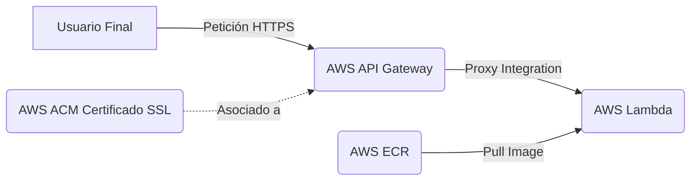

# Arquitectura del Proyecto

Este documento detalla la arquitectura en AWS para desplegar la API y provee las instrucciones paso a paso para levantar la infraestructura desde cero usando tofu (OpenTofu).

## Servicios Utilizados
- **AWS ECR (Elastic Container Registry):** Almacenamiento privado de las imágenes de contenedores Docker de la aplicación.
- **AWS Lambda:** Servicio de cómputo serverless que ejecuta la aplicación (API en Flask) a partir de la imagen almacenada en ECR.
- **AWS API Gateway (HTTP API):** Puerta de enlace HTTP que enruta el tráfico web hacia la función Lambda, actuando como un proxy (integración `AWS_PROXY`).
- **AWS ACM (AWS Certificate Manager):** Provisión del certificado SSL/TLS (validado por DNS) para asegurar la conexión utilizando el dominio personalizado (`api.argly.com.ar`).

## Diagrama de Arquitectura



## Estructura de Módulos

El proyecto está modularizado en `iaac/modules/` para mantener las responsabilidades separadas:
- `ecr`: Creación del repositorio de imágenes.
- `acm`: Solicitud y validación del certificado SSL/TLS.
- `lambda`: Definición de la función serverless y sus permisos.
- `apigateway`: Enrutamiento HTTP, integración con Lambda y configuración del dominio personalizado.

Todos estos módulos se orquestan centralmente en el directorio principal **`iaac/app`**.

## Guía de Despliegue desde Cero (Fases)

Para evitar bloqueos al crear la infraestructura desde cero (por ejemplo, Lambda necesita que la imagen Docker ya exista en ECR, y API Gateway necesita el certificado validado), el despliegue se divide en dos fases sencillas.

### Prerrequisitos
- Tener instalado **tofu** u **OpenTofu**.
- Tener configuradas las credenciales de AWS localmente (por ejemplo, con el perfil `argly`).
- Docker instalado para pushear la imagen.

---

### Fase 1: Base de Infraestructura (ECR y Certificados)

1. **Navegar al directorio de la aplicación de infraestructura:**
   ```bash
   cd iaac/app
   ```

2. **Inicializar tofu:**
   ```bash
   tofu init
   ```

3. **Aplicar los módulos base (ECR y ACM):**
   ```bash
   tofu apply -target="module.ecr" -target="module.acm"
   ```
   *Responde `yes` para confirmar.*

4. **Acciones manuales requeridas tras la Fase 1:**
   - **Validación del DNS:** Tofu te devolverá los outputs `cert_validation_name` y `cert_validation_value`. Ve a tu proveedor de DNS e ingresa ese registro CNAME para validar el certificado.
   - **Subir la imagen Docker:** Obtén el `ecr_repository_url` desde los outputs, loguéate a ECR con Docker (`aws ecr get-login-password...`), construye tu imagen Flask y súbela al repositorio ECR.

---

### Fase 2: Aplicación (Lambda y API Gateway)

Una vez que el certificado esté validado y la imagen subida a ECR:

1. **Desplegar el resto de la infraestructura:**
   ```bash
   tofu apply
   ```
   *Tofu detectará automáticamente las dependencias y creará la Lambda y el API Gateway. Responde `yes` para confirmar.*

### Pasos post-despliegue final
Al ejecutar el `apply`, tofu mostrará algunos *outputs* importantes:
- `custom_domain_target`: Debes configurar un registro CNAME en tu proveedor de DNS que apunte el subdominio `api` hacia este dominio destino.
- `cert_validation_name` y `cert_validation_value`: Deberás ingresar este registro tipo CNAME en tu proveedor de DNS para validar la propiedad del dominio y permitir que el certificado de ACM sea emitido.
- `api_url`: La URL base provista por defecto por AWS (ej: `https://xxx.execute-api.region.amazonaws.com`).
- `ecr_repository_url`: La URL del repositorio de ECR para hacer push de futuras imágenes Docker.
