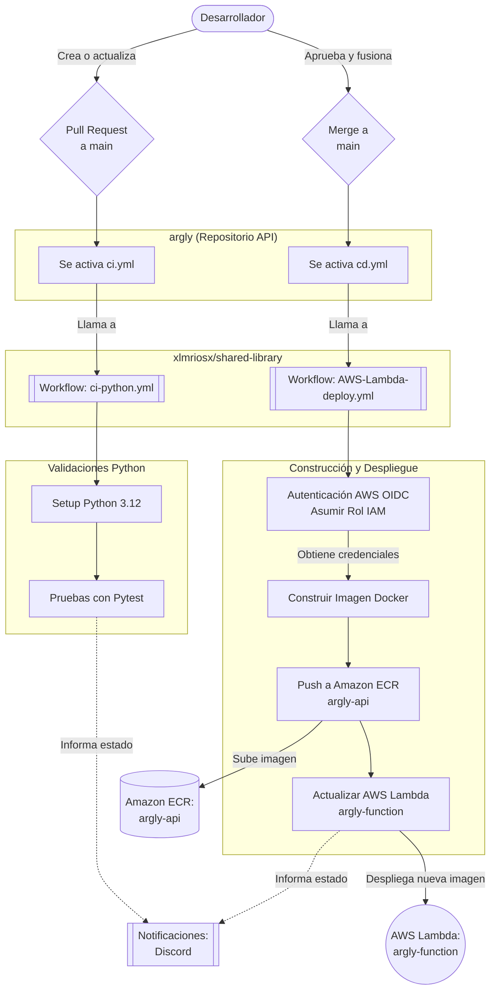

# Documentación de CI/CD (Integración y Despliegue Continuo)

Este documento describe el flujo completo de CI/CD para el backend/API **argly**, el cual utiliza GitHub Actions en conjunto con la librería compartida (*shared-library*).

## Diagrama de Flujo (Mermaid)

El siguiente diagrama ilustra cómo funciona la integración y el despliegue hacia AWS Lambda y ECR:

## Explicación del Flujo

### 1. Integración Continua (CI)
- **Cuándo se ejecuta:** Cada vez que se crea o actualiza un *Pull Request* hacia la rama `main`.
- **Flujo:** 
  1. GitHub Actions detecta el evento y ejecuta el archivo `.github/workflows/ci.yml`.
  2. Éste invoca el flujo de trabajo reutilizable `ci-python.yml` alojado en `xlmriosx/shared-library`.
  3. Prepara el entorno para **Python 3.12**.
  4. Ejecuta las pruebas automáticas utilizando `pytest` en la carpeta o módulo `test`.
  5. En caso de éxito o fallo, envía una notificación al equipo a través de **Discord**.

### 2. Despliegue Continuo (CD)
- **Cuándo se ejecuta:** Al fusionar (hacer *Merge*) o pushear directamente a la rama `main`.
- **Flujo:**
  1. Se ejecuta el archivo local `.github/workflows/cd.yml`.
  2. Llama al flujo reutilizable `AWS-Lambda-deploy.yml` de la librería compartida, con permisos para escribir *id-tokens* (`id-token: write`).
  3. **Autenticación AWS (OIDC):** Asume el rol de IAM correspondiente proporcionado a través de los secretos (`AWS_ROLE_ARN`).
  4. **Construcción y Push (ECR):** Construye la imagen Docker del proyecto y la sube (*push*) al repositorio privado de **Amazon ECR** denominado `argly-api`.
  5. **Despliegue (Lambda):** Actualiza el código de la función **AWS Lambda** llamada `argly-function` apuntando a la nueva imagen Docker subida.
  6. Envía notificaciones del resultado final a Discord.

## Detalles de la Infraestructura
A diferencia del repositorio web (estático), esta API se distribuye como un contenedor:
- **Almacenamiento de imagen:** `Amazon ECR` (Repositorio: `argly-api`).
- **Cómputo / Ejecución:** `AWS Lambda` (Función: `argly-function`) desplegada en la región `sa-east-1` (São Paulo).
